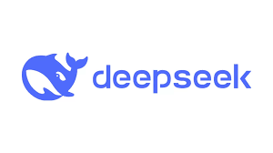
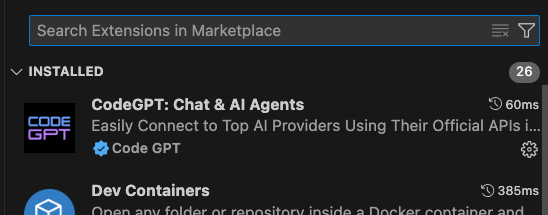
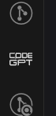
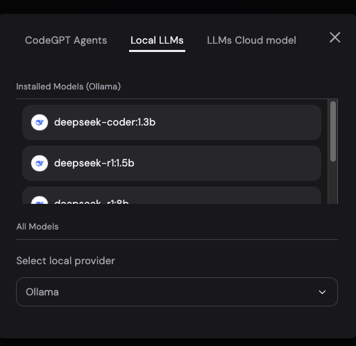
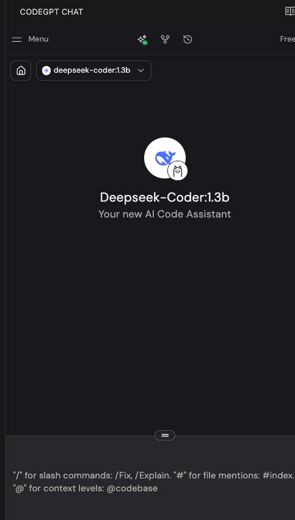

# Run DeepSeek Locally with Docker-Compose

Running DeepSeek locally with Docker-Compose is possible with a Mac, though a lighter-weight implementation of the model is recommended.

This will take you through how to run DeepSeek on localhost with a web-ui interface. 

 

AND 


<hr/>

## Steps to run with web interface

1. Install [Ollama](https://martech.org/how-to-run-deepseek-locally-on-your-computer/)

2.  Pick a model based on your hardware:
```
ollama pull deepseek-r1:8b  # Fast, lightweight  

ollama pull deepseek-r1:14b # Balanced performance  

ollama pull deepseek-r1:32b # Heavy processing  

ollama pull deepseek-r1:70b # Max reasoning, slowest

ollama pull deepseek-coder:1.3b # Code completion assist
```
3. Test the model locally via the terminal 
```
ollama run deepseek-r1:8b
```

4. Install [Docker](https://www.docker.com/get-started)

5. Install [Docker-Compose](https://formulae.brew.sh/formula/docker-compose)

6. Create Docker-Compose file as seen in this repo. 

7. Open the docker app and run `docker-compose up -d`

8. Visit `http://localhost:3000` to see your chat. 

<hr/>

## Steps to run with VScode:

1. Follow steps 1-2 in the [Steps to run with a web interface](#steps-to-run-with-web-interface), then you can also install the CodeGPT for VScode extension. 



2. Navigate to the Local LLMs section. This is likely accessed from the initial model selection drop down (pictured with claude selected).



3. From the available options, select 'Ollama' as the local LLM provider.


4. Select your DeepSeek Model and you're done.


<hr/>

## Running Open-webui without locally without internet.

1. Follow steps 1-2 in the [Steps to run with a web interface](#steps-to-run-with-web-interface)

2. Install `uv` `curl -LsSf https://astral.sh/uv/install.sh | sh`

3. Create uv env:  `mkdir ~/Documents/openwebui && uv venv --python 3.11`

4. Install open-webui: `cd ~/<your path>/openwebui && uv pip install open-webui`

5. Start open-webui: `DATA_DIR=~/.open-webui uv run open-webui serve`

6. Visit localhost and start chatting!


## Running locally via docker without internet with Open-webui

 TBD..
