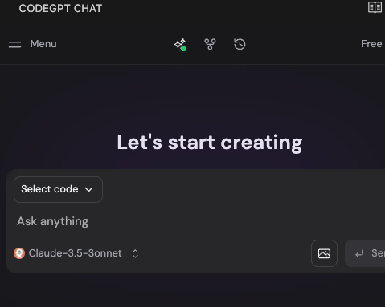

# Run DeepSeek Locally with Docker-Compose
<p align="center">
    
</p>

Running DeepSeek locally with Docker-Compose is possible with a Mac, though a lighter-weight implementation of the model is recommended.

This will take you through how to run DeepSeek on localhost with a web-ui interface. 

 

AND 


<hr/>

## Run with web interface

**These steps require internet connection**

1. Install [Ollama](https://martech.org/how-to-run-deepseek-locally-on-your-computer/)

2.  Pick a model based on your hardware:
```
ollama pull deepseek-r1:8b  # Fast, lightweight  

ollama pull deepseek-r1:14b # Balanced performance  

ollama pull deepseek-r1:32b # Heavy processing  

ollama pull deepseek-r1:70b # Max reasoning, slowest

ollama pull deepseek-coder:1.3b # Code completion assist
```
3. Test the model locally via the terminal 
```
ollama run deepseek-r1:8b
```

4. Install [Docker](https://www.docker.com/get-started)

5. Install [Docker-Compose](https://formulae.brew.sh/formula/docker-compose)

6. Create Docker-Compose file as seen in this repo. If you wish to use an internet connect, you can simply uncomment the image for the open-webui service and remove the build. 

7. Open the docker app and run `docker-compose up --build`

8. Visit `http://localhost:3000` to see your chat. 

<hr/>

## Run with VScode (offline):

1. Follow steps 1-2 in the [Steps to run with a web interface](#run-with-web-interface), then you can also install the CodeGPT for VScode extension. 


2. Navigate to the Local LLMs section. This is likely accessed from the initial model selection drop down (pictured with claude selected).



3. From the available options, select 'Ollama' as the local LLM provider.


4. Select your DeepSeek Model and you're done.


5. You can now turn off internet and using Local LLMs, continue to chat/analyze code. 

<hr/>

## Running Open-webui locally without internet

1. Follow steps 1-2 in the [Steps to run with a web interface](#run-with-web-interface)

2. Install `uv` `curl -LsSf https://astral.sh/uv/install.sh | sh`

3. Create uv env:  `mkdir ~/< project root >/< your directory name> && uv venv --python 3.11`

4. Install open-webui: `cd ~/< project root >/< your directory name > && uv pip install open-webui`

5. Start open-webui: `DATA_DIR=~/.open-webui uv run open-webui serve`

6. Visit localhost and start chatting!

<hr/>

## Running locally via docker without internet with Open-webui

1. Follow steps 1-6 in the [steps to run with a web interface](#run-with-web-interface)

2. Next, follow steps 1-4 in the [steps to running open-webui locally without internet](#running-open-webui-locally-without-internet)

3. Once this is done, create a `Dockerfile` in your chosen directory where the open-webui deps live like that seen in this project, to mimic the setup and install in the docker container of all dependencies for open-webui.

4. Next, start the app: `docker-compose up --build`. If you do not wish to see logs: `docker-compose up --build -d`

5. Visit localhost and start chatting!

6. If models are not available to select, turn on your internet temporarily, go back to the terminal and run `docker exec -it ollama bash`

7. Download the model to your service using the `ollama pull` commands seen earlier in step 1. 

8. Verify models are installed with `ollama list` while still in the cli. If so, you can turn off internet again and exit the cli with `ctrl + d` or `exit`

9. Restart your `open-webui` container with `docker-compose restart open-webui`

<hr/>

## Troubleshooting

1. Inspect the network: `docker network ls` then `docker network inspect < network >`

2. Inspect Ollama and models: 

`curl http://localhost:11434/api/tags`

- or -

`docker exec -it ollama ollama list`

3. Restart open-webui container: `docker-compose restart open-webui`

4. Depending on your hardware, running `docker-compose down` then `docker-compose up -d` to restart built containers can take a moment. Check progress with `docker logs < service name >`